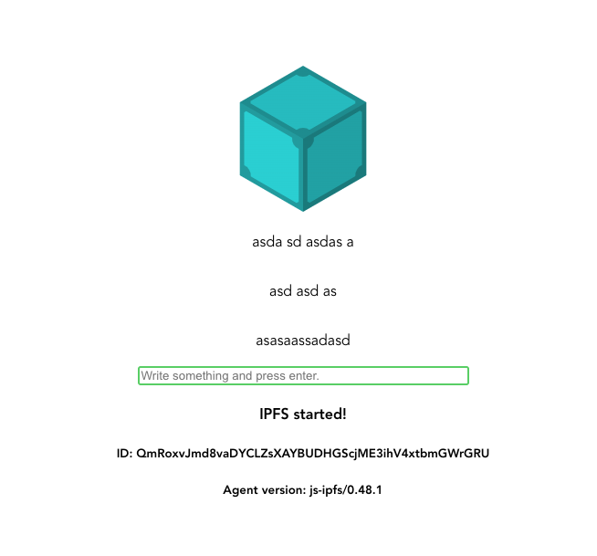

# IPFS PubSub + Vue app

A minimal demonstration of how to use `js-ipfs + pub-sub` with `Vue`.



This project was bootstrapped with [Vue CLI](https://cli.vuejs.org/).

## Before you start

First clone this repo, install dependencies in the project root and build the project.

```console
$ git clone https://github.com/filipesoccol/ipfs-vue
$ cd ipfs-vue
$ npm install
$ npm run build
```

### Compiles and hot-reloads for development

```console
$ npm run serve
```

### Compiles and minifies for production

```console
$ npm run build
```

### Run your deploy to github pages

```console
$ npm run deploy
```

### Run your tests

```console
$ npm run test
```

### Lints and fixes files

```console
$ npm run lint
```

### Signaling Servers are important

Verify signaling servers in case two peers not seen each other.
[Check here](https://github.com/filipesoccol/ipfs-vue/blob/b4ffe3bc4d7e1c09cf7cdbfd273c7b20f623eb1c/src/plugins/vue-ipfs.js#L15)

### Customize configuration

See [Configuration Reference](https://cli.vuejs.org/config/).
